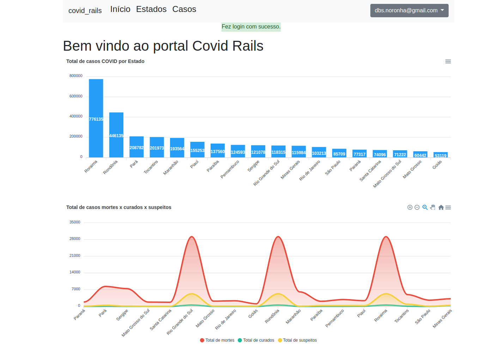

# Covid19 Rails

Projeto apresentado na semana científica da Farol - Faculdade de Rolim de Moura - Rondônia, o projeto faz parte da palestra  com o seguinte tema: Como o Ruby on Rails "salvou a minha vida" por Diego Noronha;


</br>

Objetivo: Será criado um portal que liste os caso de COVID  no Brasil por estados do

- Quantidade total de casos

- Quantidade de mortos

- Quantidade de curados

- Quantidade de suspeitos 

- Deverá constar uma interface amigável através de graficos para facilitar a interpretação do usuário.

- Deverá possuir um  controle de usuários ao acessar  a aplicação.

- Realizar o deploy da aplicação para que o cliente possa visualizar o projeto

- Deverá ser criado um repositório do projeto no GITHUB


## Vamos lá

Verifique os requisitos abaixo, fique a vontade para realizar o clone do projeto e realizar suas modificações.

### Pré requisitos

* Ruby 2.5.3

* Rails 6.0.2


Caso não tenha o Rails instalado, só seguir as seguintes dicas: 

* [Ruby on Rails Ubuntu](https://gorails.com/setup/ubuntu/18.04)
* [Ruby on Rails Windows](https://gorails.com/setup/windows/10)
* [Ruby on Rails Mac OS](https://gorails.com/setup/osx/10.15-catalina)

### Setup básico Linux

Após a instalação do Rails, abra o seu terminal e execute os seguintes comandos:

- Acessando a sua pasta home
```
cd
```
- Clone do projeto no github
```
git clone https://github.com/gitDbits/covid_rails
```
- Acesse a pasta covid_rails
```
cd covid_rails
```
- Instalado a dependências GEMS
```
bundle install 
```
## Dependências YARN

- Execute o comando para o yarn verificar todas as dependências
```
yarn install --check-files
```

## Configurando banco de dados PostgreSQL

- Execute o comando para instalar no linux
```
sudo apt install postgresql-11 libpq-dev
```

- Vamos criar um usuário sudo para o banco de dados
```
sudo -u postgres createuser covid_rails -s
```

- Vamos criar uma senha de acesso para esse usuário
```
sudo -u postgres psql
```
  - Após abrir o console do postgre digite \password e informe a senha
  - Para sair do console basta digitar \q

- Vamos criar o banco de dados, execute o comando
```
rails db:create
rails db:migrate
```
- Agora vamos popular o banco de dados com algumas informações testes :)
```
rails db:seed
```

## Acessando o covid_rails

- Execute o servidor local
```
rails s
```
- Basta criar um usuário e pronto :)

## Construido com

* [Ruby on Rails](https://rubyonrails.org/) - The Ruby on Rails framework for API

* [Devise](https://github.com/heartcombo/devise) - Flexible authentication solution for Rails with Warden

* [Pagy](https://github.com/ddnexus/pagy) - The ultimate solution pagination Rails

* [Font Awesome](https://fontawesome.com/) - Library icons CSS

* [Bootstrap](https://getbootstrap.com/) - Framework for building responsive, mobile-first sites

* [Apexcharts](https://getbootstrap.com/) - ApexCharts.RB is a ruby charting library that's going to give your ruby app beautiful, interactive, and responsive charts powered by ApexCharts.JS

* [Pagy](https://getbootstrap.com/) - Pagy is the ultimate pagination gem that outperforms the others in each and every benchmark and comparison.

* [Ransack](https://getbootstrap.com/) - Ransack enables the creation of both simple and advanced search forms for your Ruby on Rails application